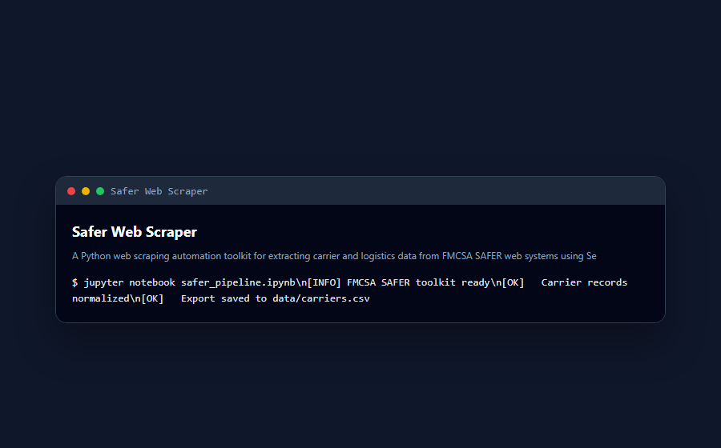

<div align="center">

# 🚀 Safer Web Scraper

**A Python web scraping automation toolkit for extracting carrier and logistics data from FMCSA SAFER web systems using Selenium and Jupyter notebooks.**

Documented · MIT licensed · Maintained


[](LICENSE)
[](CONTRIBUTING.md)

</div>

---

## 🐍 Contribution graph

<picture>
  <source media="(prefers-color-scheme: dark)" srcset="https://raw.githubusercontent.com/mafzalkalwardev/safer-web-scraper/output/snake-dark.svg" />
  <source media="(prefers-color-scheme: light)" srcset="https://raw.githubusercontent.com/mafzalkalwardev/safer-web-scraper/output/snake.svg" />
  
</picture>

---

\# SAFER Web Scraper

A Python web scraping automation toolkit for extracting carrier and logistics data from FMCSA SAFER web systems.

The project includes Selenium automation and Jupyter notebook workflows for scraping carrier information, processing datasets, and automating logistics research tasks.

\## Screenshots

## Screenshots



## Features

\- Web scraping automation

\- FMCSA SAFER scraping

\- Selenium browser automation

\- Carrier data extraction

\- Jupyter notebook workflows

\- CSV and Excel processing

\- Logistics automation

\- Data collection tools

\## Tech Stack

\- Python

\- Selenium

\- Pandas

\- Jupyter Notebook

\- Web Scraping

\## Project Structure

```text

safer-web-scraper/

│

├── scrapp.ipynb

├── WebScrapping-saferweb.ipynb

├── README.md

└── .gitignore

```

\## Installation

Install required packages:

```bash

pip install selenium pandas notebook

```

\## How to Run

Start Jupyter Notebook:

```bash

jupyter notebook

```

Then open:

```text

scrapp.ipynb

```

or

```text

WebScrapping-saferweb.ipynb

```

\## Features Overview

\### SAFER Web Scraping

Automates carrier and MC-related data extraction.

\### Selenium Automation

Uses browser automation for interacting with dynamic websites.

\### Data Processing

Supports CSV and Excel-based workflows.

\## Use Cases

\- Carrier research

\- Logistics automation

\- Dispatch workflows

\- Data extraction

\- Lead generation

\## Security Note

Do not upload:

\- private datasets

\- sensitive records

\- confidential scraped information

\## Author

Muhammad Afzal Kalwar

GitHub:

@mafzalkalwardev
